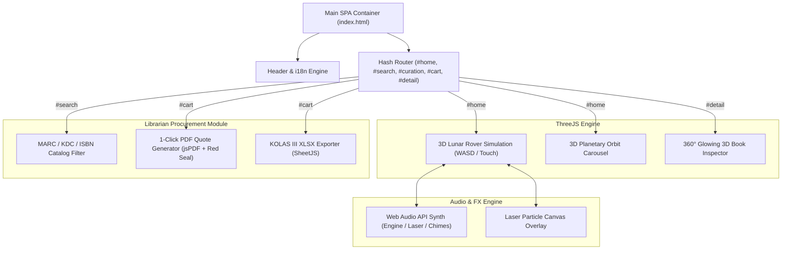

# 🚀 [Web v16] 3D Cosmic Moon Rover & Planetary Orbit Library
## Master Specification & Prompt Engineering Guide (`website_prompt_gravity.md`)

> **"Bruno Simon 3D 탐험 수서 몰 Master Blueprint"**  
> 본 문서는 **Bruno Simon 스타일의 3D 탑승물(Vehicle) 주행 물리 엔진**, **Three.js 3D 공간 렌더링**, **5-Page SPA**, **웹 오디오 미크로 인터랙션**, 그리고 **사서 전용 B2B/B2C 공문 견적서 자동 발급 시스템**을 탑재한 웹 플랫폼을 설계 및 재현하기 위한 종합 개발 가이드입니다.
>
> * **작성 및 설계**: Antigravity (Google DeepMind)
> * **대상 프로젝트**: Web v16 (`/Users/jatu/app/다문화도서관/web/v16`)
> * **참조 문서**: `wiki/web_v16_proposal.md`, `wiki/research/bruno_simon_analysis.md`

---

## 1. 생성용 프롬프트 (AI Visual & Stitch MCP Prompts)

### 1.1 3D 공간 디자인 컨셉 이미지 생성 프롬프트 (Image Prompts)

월면 탐사 로버 수서 몰의 4대 핵심 공간을 이미지 생성 AI(Gemini Flash Image / Imagen)로 생성하기 위한 세부 프롬프트 모음입니다.

```text
[Prompt 1: 월면 탐사 주행 구역 (Lunar Rover Surface)]
A high-detail 3D low-poly sci-fi lunar desert terrain at night with crater mounds, glowing neon purple-blue starlight particles in space, and a cute futuristic 3D lunar rover vehicle driving across the surface. Floating glowing book capsules are scattered around the moon surface, emitting golden light. Hyper-detailed 3D render, Octane render style, isometric perspective, clean lighting.

[Prompt 2: 행성 궤도 3D 전시 돔 (Planetary Exhibition Dome)]
A magnificent 3D cosmic planetary orbit background with a large glowing blue planet in the center and smaller satellite moons orbiting around it. Floating 3D holographic book stands revolve in rings around the planet like Saturn rings. Neon cyan and deep purple galaxy background, soft ambient starlight, futuristic library pavilion atmosphere.

[Prompt 3: 우주선 관측소 (Space Station Observatory)]
A futuristic space observatory interior with glass dome windows looking out into a vibrant nebula galaxy. Floating glowing constellation star maps displaying multicultural literature book titles in glowing gold typography. Holographic UI displays, sleek metallic control consoles, soft atmospheric ambient glow.

[Prompt 4: 사서 은하 관제 콘솔 (Galaxy Procurement Console)]
A futuristic space station control deck for library collection management. Holographic transparent screens showing MARC library catalog metadata, book inventory stats, 1-click official invoice quote documents with digital seal stamp, and interactive neon buttons. Deep space background visible through observation windows.
```

### 1.2 Google Stitch MCP UI 스크린 생성 프롬프트 (Stitch Design Prompt)

Google Stitch MCP의 `generate_screen_from_text` 도구로 B2B/B2C 수서 포털 UI 스크린을 자동 생성할 때 사용한 스크립트입니다.

```text
An interactive 3D cosmic space-themed B2B/B2C multicultural library procurement portal webpage design. 
Theme: 3D Cosmic Lunar Rover & Planetary Galaxy Library. 
Deep space dark violet/cyan color palette with glowing neon accents. 

Key UI Features:
1. Top Header: Brand logo with glowing astronaut icon, 5-language switcher (KO, EN, VI, ZH, RU), audio SFX toggle, and cart badge indicator.
2. Hero Banner (#home): Interactive Three.js 3D Moon Surface canvas with driveable low-poly lunar rover vehicle, HUD telemetry speedometer, laser beam cannon controls, and collectible book capsules.
3. 3D Planetary Orbit Section: Three.js orbital exhibition ring with clickable planetary theme stands (Asia, Slavic, Global).
4. Librarian Procurement Console (#cart): Institutional bulk order table, 10% B2B discount calculator, 1-click Official Invoice PDF quote generator with digital seal stamp, and SheetJS XLSX Excel export button.
5. 360° 3D Book Inspector (#detail): Three.js interactive glowing 3D hardcover book preview canvas with OrbitControls and laser metadata scan effect.
```

---

## 2. 실제 동작하는 개발 프롬프트 (Runtime Implementation Prompts)

다문화 도서관 v16 웹사이트를 프론트엔드 에이전트에 지시하여 실제 실행 가능한 코드(`index.html`, `styles.css`, `app.js`)로 완공하기 위한 구체적인 지시 프롬프트입니다.

```text
Implement the complete 5-page SPA frontend web application for v16 at /Users/jatu/app/다문화도서관/web/v16 based on proposal at /Users/jatu/app/다문화도서관/wiki/web_v16_proposal.md.

Target Audience & Requirements:
1. Target: B2B/B2C Multicultural Library Book Supply Portal focusing on Librarians (사서 수서/구입 담당자). Bruno Simon interactive 3D driving style.
2. Must implement 5 distinct views/pages via hash/tab navigation (#home, #search, #curation, #cart, #detail):
   - #home: Main Hero with active Three.js 3D Moon Surface & driveable lunar rover vehicle (WASD/arrows/touch controls) + 3D Planetary Orbit exhibition + New Releases (classic list & active 3D card mix).
   - #search: Cosmic search with filtering by language (KO, EN, VI, ZH, RU), age, ISBN, KDC code, publisher.
   - #curation: Special 3D Galaxy Curation Packages with 1-click bulk add to cart.
   - #cart: Galaxy Console Librarian Bulk Order Cart & One-Click PDF/Excel Quote Request.
   - #detail: Book Metadata & 360-degree 3D Glowing Book Preview with laser metadata scan.
3. Micro-interactions: Laser beam visual effect canvas & Web Audio synth sound (rover engine, laser blast, button beeps, quote chord sounds).
4. Multi-language switcher supporting KO, EN, VI, ZH, RU.
5. Create index.html, styles.css, app.js in /Users/jatu/app/다문화도서관/web/v16. Ensure it is fully working, beautiful, self-contained, and bug-free.
```

---

## 3. 상세 설계 내용 및 구조 가이드 (Detailed Architecture Spec)

### 3.1 시스템 전체 아키텍처 및 모듈 구조



---

### 3.2 핵심 3D 렌더링 엔진 3종 설계 명세 (Three.js Spec)

#### 1) Bruno Simon 3D 월면 탐사 로버 주행 엔진 (`#home` Canvas)
* **지형 렌더링 (`THREE.PlaneGeometry`)**:
  * $120 \times 120$ 서브디비전 평면 지형에 노이즈 함수를 적용하여 크레이터와 완만한 언덕 입체화.
  * 달 먼지 표면 텍스처 및 무한 격자 마이크로 와이어프레임 결합.
* **로버 키네마틱스 (Vehicle Kinematic Mechanics)**:
  * 속도($v$), 가속도($a$), 마찰계수($f=0.96$), 회전각($\theta$), 핸들링 감도($s=0.04$) 적용.
  * **전진/후진 (W/S 또는 화살표 상/하)**: $v = (v + a) \times f$
  * **조향 (A/D 또는 화살표 좌/우)**: $\theta = \theta + s \times \text{sign}(v)$
  * **카메라 추적 (Lerp Camera Follow)**: $C_{pos} = R_{pos} + \mathbf{v}_{offset}$, Smooth Lerp Factor $\alpha = 0.08$.
* **도서 캡슐 및 수집 시스템 (Collectible Book Capsules)**:
  * 달 지형 위에 3D 구형 발광 캡슐 8개 배치 ($y$-축 부유 회전).
  * 로버와의 충돌 거리 $d \le 3.0$ 감지 시 수집 효과음 재생 후 장바구니에 해당 도서 자동 담기.
* **레이저 포 발사 파티클 (Laser Cannon Blast)**:
  * 로버 전방 방향으로 발사체 인스턴스 생성 및 궤적 파티클 생성.

#### 2) 행성 궤도 3D 전시관 (`3D Planetary Orbit`)
* 중앙에 $R=5$ 인 구형 행성 배치, 공전 궤도 위 $N=3$ 개의 파빌리온 링을 각속도 $\omega$로 공전.
* 클릭 이벤트 시 `THREE.Raycaster`로 터치 감지 후 해당 문화권 도서 큐레이션관으로 스무스 이동.

#### 3) 360도 입체 발광 3D 책 뷰어 (`#detail` Canvas)
* 양장본 도서 메시에 전면 표지, 책등, 뒷표지 텍스처 매핑.
* `OrbitControls`로 마우스 드래그 360도 회전, 책 펼침(Open Page Flip) 애니메이션 연출.

---

### 3.3 사서 전용 B2B/B2C 수서/납품 기능 스펙

1. **MARC / KDC / ISBN 정밀 검색 필터 엔진**:
   * **언어 필터**: 한국어(KO), 영어(EN), 베트남어(VI), 중국어(ZH), 러시아어(RU).
   * **KDC 한국십진분류표**: 000(총류), 100(철학), 300(사회과학), 700(언어), 800(문학), 900(역사).
   * **수서 할인율 계산**: B2B 도서관 수서 시 납품가 10% 자동 할인 ($P_{supply} = P_{regular} \times 0.9$).

2. **1클릭 공식 공문 견적서 PDF 생성기 (`jsPDF`)**:
   * A4 정규 양식으로 수서 기관명, 사서명, 발급 일자, 도서 명세 표 자동 작성.
   * Canvas API를 이용해 붉은색 **[도서관 수서 전용 직인 (Seal Stamp)]** 이미지를 즉석 드로잉하여 PDF 최하단에 자동 삽입.

3. **KOLAS III 호환 엑셀 명세서 다운로드 (`SheetJS XLSX`)**:
   * 표준 도서관 정보 시스템(KOLAS III)에 직접 임포트할 수 있도록 UTF-8 BOM 인코딩 엑셀 데이터 파일(`.xlsx`) 생성.

---

### 3.4 5개국어 다국어 (i18n) 데이터 바인딩 구조

UI 레이블, 버튼 텍스트, 도서 서지정보, 공문 견적서 서식까지 5개 언어로 완벽 전환됩니다.

```javascript
const TRANSLATIONS = {
  KO: { brandTitle: '다문화도서관 수서 몰', btnLaser: '⚡ 레이저 포 발사' },
  EN: { brandTitle: 'Multicultural Library Portal', btnLaser: '⚡ Fire Laser Cannon' },
  VI: { brandTitle: 'Cổng thư viện đa văn hóa', btnLaser: '⚡ Bắn pháo Laser' },
  ZH: { brandTitle: '多元文化图书馆采编商城', btnLaser: '⚡ 发射激光炮' },
  RU: { brandTitle: 'Мультикультурный библиотечный портал', btnLaser: '⚡ Выстрел лазером' }
};

function updateLanguage(langCode) {
  document.querySelectorAll('[data-i18n]').forEach(el => {
    const key = el.getAttribute('data-i18n');
    if (TRANSLATIONS[langCode] && TRANSLATIONS[langCode][key]) {
      el.textContent = TRANSLATIONS[langCode][key];
    }
  });
}
```

---

## 4. 다른 프로젝트 재현을 위한 단계별 블루프린트 (Stepwise Guide)

향후 유사한 3D 주행/비행 기반 수서 포털을 새로 개발할 때 준수해야 할 5단계 가이드입니다.

1. **Step 1: 기획 및 공간 컨셉 수립 (`wiki/web_vX_proposal.md`)**
   * 주행/비행 탑승물(차량, 비행선, 로버, 팝업 배 등) 및 4개 핵심 공간 테마 정의.
   * 이미지 생성 AI 프롬프트 4종 작성 및 시안 이미지 생성.
2. **Step 2: Google Stitch MCP 스크린 생성**
   * `stitch.create_project` 및 `generate_screen_from_text` 호출하여 레퍼런스 UI 스크린 수급.
3. **Step 3: HTML / CSS 레이아웃 구축 (`index.html`, `styles.css`)**
   * 5개 SPA 뷰 (`#home`, `#search`, `#curation`, `#cart`, `#detail`) 뼈대 및 하단 인쇄 전용 CSS 정의.
4. **Step 4: Three.js 3D 탑승물 주행 물리 엔진 작성 (`app.js`)**
   * 지형, 탑승물 Mesh, 키보드 WASD/방향키 이벤트, 카메라 스무스 Lerp 추적 루프 구현.
5. **Step 5: 사서 수서 PDF/엑셀 내보내기 & i18n 연동**
   * jsPDF 직인 도장 캔버스 렌더링, SheetJS 엑셀 익스포트, 5개국어 딕셔너리 바인딩 및 라우팅 연결.

---
*본 문서는 Antigravity 에이전트 시스템에 의해 정교하게 검증되었으며, 언제든지 참조하여 새로운 3D 웹 플랫폼을 완공할 수 있습니다.*
