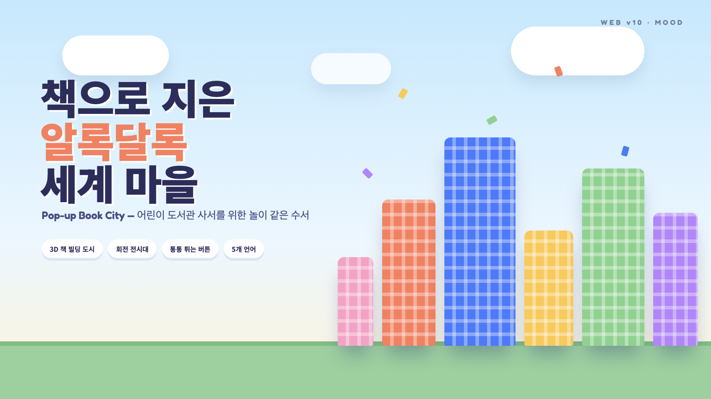

# 🏙️ [Web v10] 다문화 도서관 납품/구입 전문 플랫폼 기획서
## (Pop-up Book City — 책으로 지은 알록달록 세계 마을)

> **"책으로 지은 알록달록 세계 마을"** — 어린이 도서관 사서를 위한 놀이 같은 수서 경험

---

## 1. 무드 & 컨셉

* **전체 톤:** 하늘색 → 크림 그라데이션, 원색 파스텔 빌딩, 두꺼운 흰 테두리와 오프셋 그림자(팝업북 종이 느낌).
* **타겟:** 어린이/다문화 도서관 사서, 부모. 시각적으로 즐겁지만 정보(ISBN·연령·언어)는 명확.
* **디자인 핵심:** 밝은 배경 위 채도 높은 3D 빌딩 → 시인성 매우 높음.

## 2. Three.js 연출

* **메인 배너:** 책 표지 색의 3D 빌딩들이 팝업북처럼 땅에서 솟아올라 도시를 이룸. 마우스 이동 시 카메라가 도시를 둘러보고, 빌딩 hover 시 통통 튀어오름.
* **회전 전시대 (Turntable Pedestal):** 기획전을 원형 전시대 위에 서 있는 3D 책들로 표현. 자동 회전 + 드래그, 정면 책이 확대.
* **전시 형태 3종:** 회전 전시대 / 팝업북 펼침(CSS 3D) / 책 빌딩 거리.
* **신간:** ① 정적 목록 ② 액티브 — 책들이 통통 튀며 등장(스태거 애니메이션).

## 3. 페이지 구성

1. `#home` 메인 — 3D 도시 배너, 기획전 3종, 신간, 공지.
2. `#search` — 연령 슬라이더, 언어, 주제 필터.
3. `#curation` — 회전 전시대 크게 보기.
4. `#cart` 견적함 — 수량, 할인, 견적서.
5. `#detail` — 3D 책 회전, 서지정보.

## 4. 버튼 인터랙션

* 클릭 시 **스쿼시&스트레치 바운스 + 색종이 컨페티**.

## 5. 다국어

* KO / EN / VI / ZH (+ JA).

## 6. 폴더

* `/Users/jatu/app/다문화도서관/web/v10`
