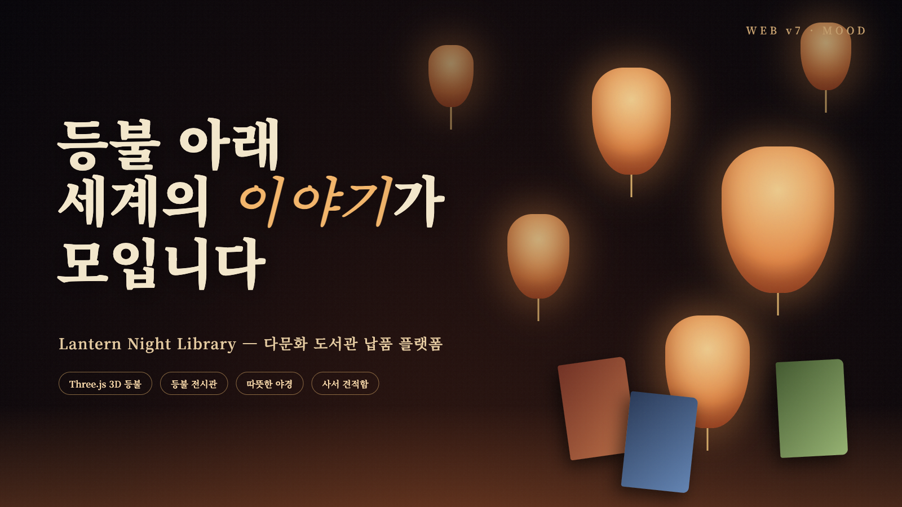

# 🏮 [Web v7] 다문화 도서관 납품/구입 전문 플랫폼 기획서
## (Lantern Night Library — 3D 등불 축제 & 등불 전시관)

> **"등불 아래 세계의 이야기가 모입니다"** — 따뜻한 야경 속에서 사서가 편안하게 수서하는 프리미엄 다문화 도서 몰

---

## 1. 무드 & 컨셉

* **전체 톤:** 깊은 자정색 배경 + 호박빛 등불 광원. 세계 각국의 등불 축제(연등회, 로이끄라통, 디왈리, 원소절)를 모티프로 함.
* **타겟:** 공공/학교 도서관 사서(수서 담당), 다문화 가정 이용자.
* **디자인 핵심:** 어두운 배경 위 고대비 타이포로 시인성 확보. 3D 등불 오브젝트가 배너를 떠다니며 마우스를 따라 흔들림.

## 2. Three.js 연출

* **메인 배너:** 수십 개의 3D 등불(Lathe/Sphere 지오메트리 + 발광 재질)이 서로 다른 속도로 상승·부유. 마우스 위치에 따라 카메라 패럴랙스, 클릭 시 등불에서 불티 파티클 방출.
* **등불 전시관 (3D Lantern Hall):** 기획전마다 원형 회랑에 도서 표지가 등불처럼 매달린 3D 룸. 드래그로 360° 회전, 표지 클릭 시 상세로 이동.
* **신간:** ① 정적 리스트 뷰(사서용 서지 표) ② 액티브 뷰 — 표지 카드가 등불처럼 흔들리며(hover) 빛을 냄.

## 3. 페이지 구성 (해시 라우팅)

1. `#home` 메인 — 3D 배너, 기획전(등불 전시관 / 야시장 가판대 / 하늘 등불 띄우기 3가지 전시 형태), 신간(정적+액티브), 사서 공지.
2. `#search` 도서 검색 — 언어·연령·주제·납품 가능 여부 필터, ISBN 검색, 결과 카드 → 견적함 담기.
3. `#curation` 큐레이션 — 기획전 목록 + 선택 기획전 3D 등불 전시관.
4. `#cart` 견적함(장바구니) — 수량, 기관 할인율, 합계, 견적서 발급(PDF 인쇄).
5. `#detail` 도서 상세 — 3D 회전 표지, 서지정보(ISBN/KDC/언어/대상), 담기.

## 4. 버튼 인터랙션

* 클릭 시 **불꽃이 번지는 글로우 링 + 불티 파티클** (등불이 켜지는 느낌).
* 견적함 담기 시 상단 견적함 아이콘이 등불처럼 한 번 깜빡임.

## 5. 다국어

* KO / EN / VI / ZH 4개 언어, `data-i18n` 속성 기반 사전 치환, 선택 언어는 로컬 저장.

## 6. 폴더

* `/Users/jatu/app/다문화도서관/web/v7`
