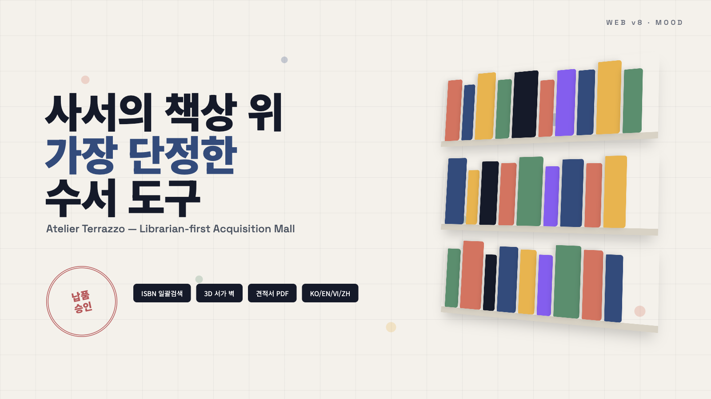

# 📐 [Web v8] 다문화 도서관 납품/구입 전문 플랫폼 기획서
## (Atelier Terrazzo — 사서 우선 수서 데스크 & 3D 서가 벽)

> **"사서의 책상 위 가장 단정한 수서 도구"** — 밝고 절제된 테라조 톤, 업무 도구 같은 명료함

---

## 1. 무드 & 컨셉

* **전체 톤:** 아이보리 종이 배경 + 테라조 칩 컬러(코랄/네이비/머스타드/그린). 격자 가이드라인이 살짝 비치는 '설계 도면' 감성.
* **타겟:** 대량 수서를 처리하는 사서. 정보 밀도가 높지만 정렬이 단정한 레이아웃.
* **디자인 핵심:** 밝은 배경에서도 3D 오브젝트가 또렷하게 보이도록 강한 색면 + 부드러운 그림자.

## 2. Three.js 연출

* **메인 배너:** 테라조 색상의 3D 책 블록들이 공중에서 천천히 회전하며 정렬/흩어짐을 반복(모핑). 마우스 이동 시 블록 전체가 기울어짐.
* **3D 서가 벽 (Shelf Wall):** 기획전을 실제 서가 벽처럼 3D로 렌더링. 마우스 이동에 따라 서가가 기울고, 책등 hover 시 책이 앞으로 튀어나옴, 클릭 시 상세.
* **전시 형태 3종:** 서가 벽 / 도면 격자(Blueprint Grid) / 회전 북스탠드.
* **신간:** ① 사서용 데이터 테이블 ② 액티브 — 3D 틸트 카드(마우스에 따라 기울고 광택이 흐름).

## 3. 페이지 구성

1. `#home` 메인 — 배너, 사서 KPI 바(납품 예정/승인 대기), 기획전 3종, 신간, 공지.
2. `#search` 검색 — ISBN 일괄 입력(여러 줄 붙여넣기), 언어/연령/출판사 필터, 리스트/그리드 전환.
3. `#curation` — 기획전 선택 시 3D 서가 벽.
4. `#cart` 견적함 — 수량 편집, 기관 할인, 예산 대비 잔액, 견적서 출력.
5. `#detail` — 3D 책 회전, 서지·납품 정보, 유사 도서.

## 4. 버튼 인터랙션

* 클릭 시 **인주 도장(Stamp) 찍힘** 효과: 버튼이 살짝 눌리며 붉은 잉크 링이 번짐.
* 담기 버튼은 체크 마크로 잠시 변환.

## 5. 다국어

* KO / EN / VI / ZH, `data-i18n` 사전.

## 6. 폴더

* `/Users/jatu/app/다문화도서관/web/v8`
