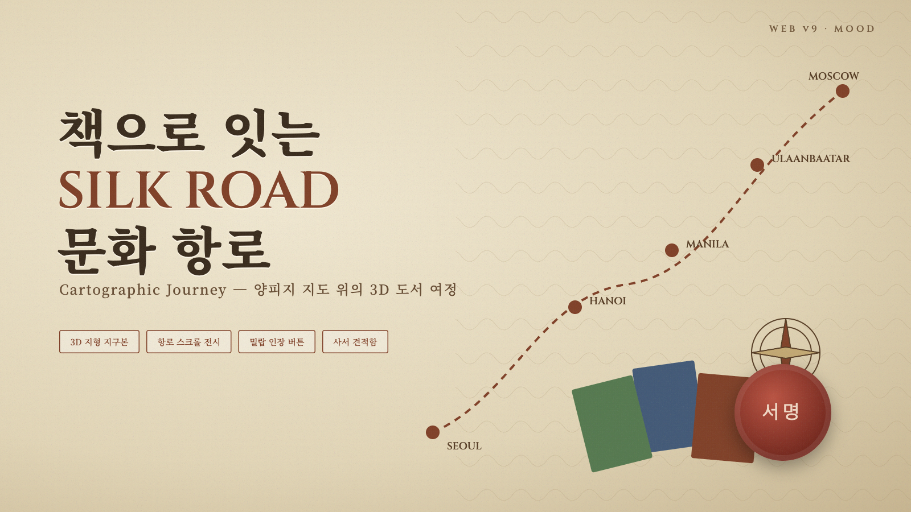

# 🗺️ [Web v9] 다문화 도서관 납품/구입 전문 플랫폼 기획서
## (Cartographic Journey — 양피지 지도 위의 3D 문화 항로)

> **"책으로 잇는 문화 항로"** — 옛 지도의 낭만과 사서의 실무를 함께 담은 탐험형 몰

---

## 1. 무드 & 컨셉

* **전체 톤:** 양피지 베이지 + 세피아 잉크 + 밀랍 인장 레드. 나침반, 점선 항로, 컴퍼스 장식.
* **타겟:** 사서(수서/전시 기획)와 다문화 가정. "출신국 → 한국" 항로를 따라 책을 탐색하는 서사.
* **디자인 핵심:** 따뜻한 밝은 배경 위 어두운 세피아 3D 오브젝트로 고대비 확보.

## 2. Three.js 연출

* **메인 배너:** 와이어프레임+포인트로 그린 3D 지구본이 천천히 자전. 주요 도시 좌표에 핀이 꽂히고, 도시 간 곡선 항로(베지에)를 따라 빛 입자가 흐름. 드래그로 회전.
* **항로 전시 (Route Exhibition):** 기획전을 하나의 항로로 구성. 스크롤/버튼으로 카메라가 3D 정거장을 순서대로 이동하며 각 정거장에 책이 서 있음.
* **전시 형태 3종:** 항로 정거장 / 캐러밴 커버플로우(3D) / 보물지도 핀.
* **신간:** ① 정적 목록(서지 표) ② 액티브 — 3D 커버플로우 캐러밴(좌우 드래그).

## 3. 페이지 구성

1. `#home` 메인 — 3D 지구본 배너, 기획전 3종, 신간, 사서 공지.
2. `#search` — 원산 국가(지도 핀 선택), 언어, 연령, 납품 상태 필터.
3. `#curation` — 항로 전시 전체 화면.
4. `#cart` 견적함 — 수량, 할인, 견적서 발급.
5. `#detail` — 3D 책 회전, 원산국 표시, 서지정보.

## 4. 버튼 인터랙션

* 클릭 시 **밀랍 인장(Wax Seal) 찍기**: 붉은 인장이 눌리며 잉크가 번지고 종이 결이 살짝 흔들림.

## 5. 다국어

* KO / EN / VI / ZH.

## 6. 폴더

* `/Users/jatu/app/다문화도서관/web/v9`
